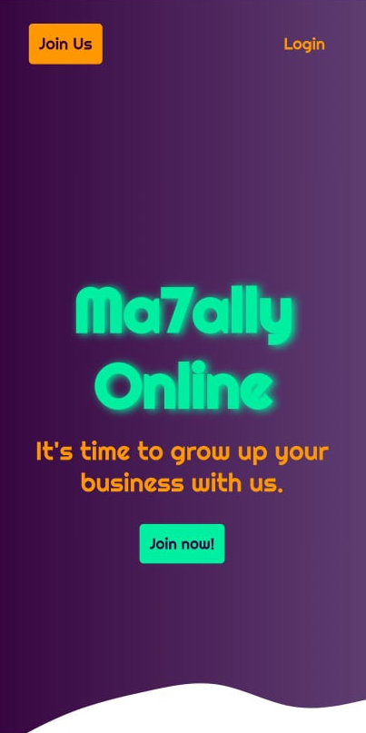

# Ma7ally Online - Online shops for sellers!

> This project is a single-page app built mainly with React.js. It is a service for people who want to sell online. It's consuming my Ruby on Rails API;

<div align="center">




</div>

## Technologies

- Node.js
- React
- React-Redux
- Redux
- create-react-app
- npm
- CSS
- ES6

## Live Demo

[Live Demo Link](http://ma7ally-online.herokuapp.com/)

## Usage

```
- git clone "https://github.com/Mohamed-js/ma7ally-online.git"
- cd ma7ally-online
- npm install
- npm start
```

## Authors

👤 **Mohammed Atef**

- GitHub: [Mohamed Atef](https://github.com/Mohamed-js)
- Twitter: [@Mohamed Atef](https://twitter.com/Demovejetta)
- LinkedIn: [LinkedIn](https://www.linkedin.com/in/mohamed-js/)

## 🤝 Contributing

Contributions, issues, and feature requests are welcome!

## Show your support

Give a ⭐️ if you like this project!

## Acknowledgments

## 📝 License

This project is [MIT](https://github.com/Mohamed-js/Capstone-Project-1/blob/dev-area/LICENSE.md) licensed.
